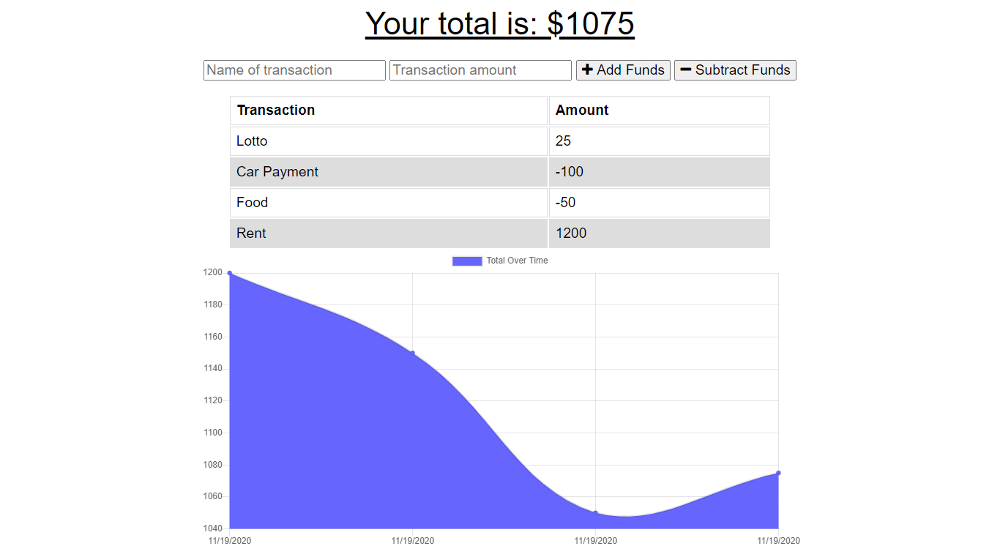

# homework_18_progressive_budget

#
For this assignment, added the functionality to an existing Budget Tracker application to allow for offline access and functionality.

The user will be able to add expenses and deposits to their budget with or without a connection. When entering transactions offline, they should populate the total when brought back online.

Offline Functionality:

  * Enter deposits offline

  * Enter expenses offline

When brought back online:

  * Offline entries should be added to tracker.

## User Story

* Giving users a fast and easy way to track their money is important, but allowing them to access that information anytime is even more important. Having offline functionality is paramount to our applications success.

## Installation

To use application simply click on Heroku Link below

## Usage

Not Applicable 

## Technologies Used

    ** NPM install:  
    "bootstrap": "^4.5.3",
    "compression": "^1.7.4",
    "express": "^4.17.1",
    "lite-server": "^2.5.3",
    "mongoose": "^5.5.15",
    "morgan": "^1.9.1"b

## Problems I faced

I had some isses with AtlasDB

## Credits

Ryan Witherspoon

## Image

## Links
[Link to GitHub!](https://github.com/ryanwit/homework_18_progressive_budget)

[Link to Heroku!](https://stark-oasis-76385.herokuapp.com/)

